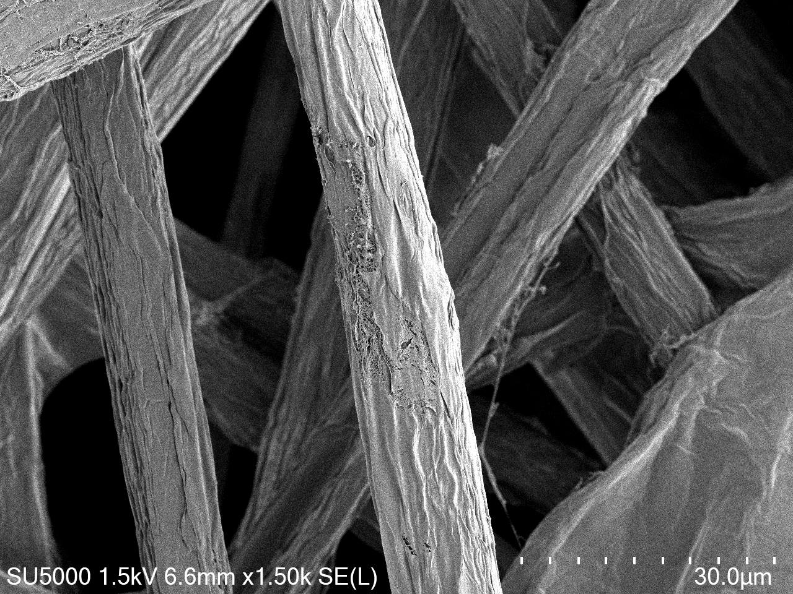
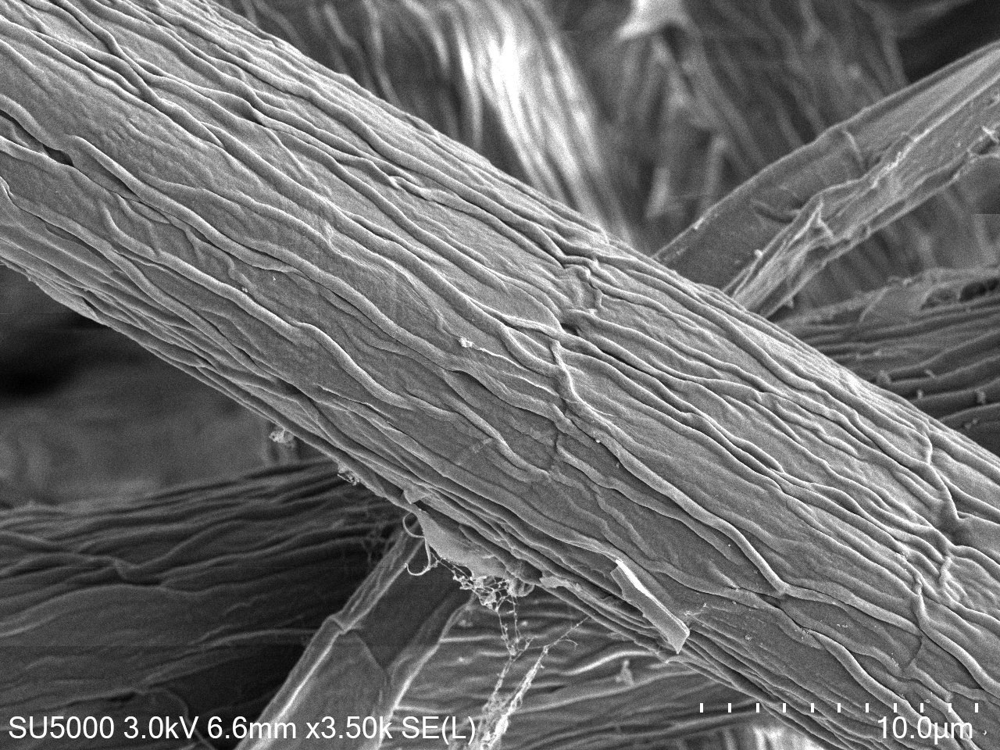
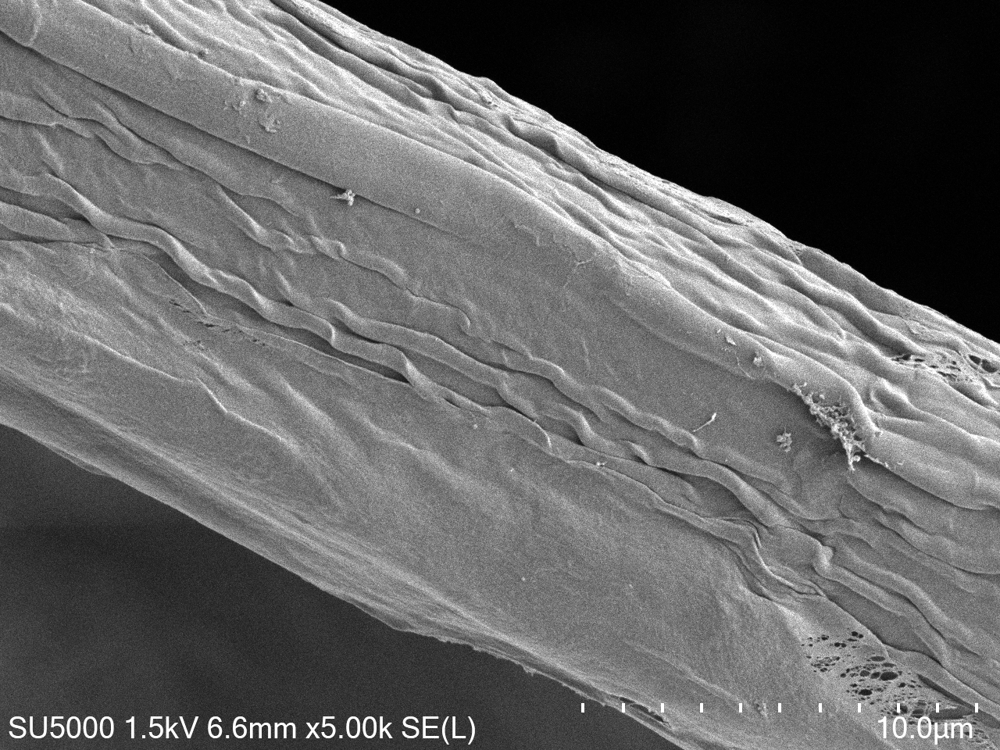

# SF-ViM
A texture recognition model

## Dataset

- Describable Textures Dataset (DTD) ([https://www.robots.ox.ac.uk/~vgg/data/dtd/](https://www.robots.ox.ac.uk/~vgg/data/dtd/))
- Flickr Material Database (FMD) ([https://people.csail.mit.edu/celiu/CVPR2010/FMD/](https://people.csail.mit.edu/celiu/CVPR2010/FMD/))
- KTH-TIPS (KTH) ([https://www.csc.kth.se/cvap/databases/kth-tips/credits.html](https://www.csc.kth.se/cvap/databases/kth-tips/credits.html))
- Ground Terrain in Outdoor Scenes mobile (GTOSM) ([https://drive.google.com/file/d/1Hd1G7aKhsPPMbNrk4zHNJAzoXvUzWJ9M/view](https://drive.google.com/file/d/1Hd1G7aKhsPPMbNrk4zHNJAzoXvUzWJ9M/view))
- SEM dataset
  <figure class="half">
    
    
    
</figure>
